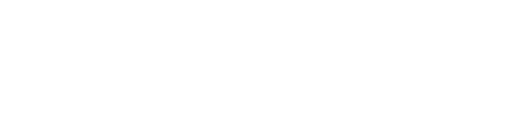

## Hi. I'm João. ✨

Whenever I'm not **making music**, **playing guitar**, **sound designing** or **repairing cracked cold solder joints from old electronics**, I'm most likely **fixing/modding my** *(barely functioning)* **car**... to various degrees of success.

I'm passionate about **microcontrollers**, **embedded systems** and **digital electronics**, with most of my **professional experience** being in **robotic systems design** and **prototyping**. I've also had a fling with the **rail industry** building **control units** for **vehicles** and **tracks**. *I did also sign an NDA which prevents me from yapping too much about it*. Boo. 

---

**Fancy stalking me?** Head on over to [my music blog](https://joaogusmao.music.blog/), in which you'll find semi-coherent ramblings on music and audio.

<!--
**jonyism/jonyism** is a ✨ _special_ ✨ repository because its `README.md` (this file) appears on your GitHub profile.

Here are some ideas to get you started:

- 🔭 I’m currently working on ...
- 🌱 I’m currently learning ...
- 👯 I’m looking to collaborate on ...
- 🤔 I’m looking for help with ...
- 💬 Ask me about ...
- 📫 How to reach me: ...
- 😄 Pronouns: ...
- ⚡ Fun fact: ...
-->
